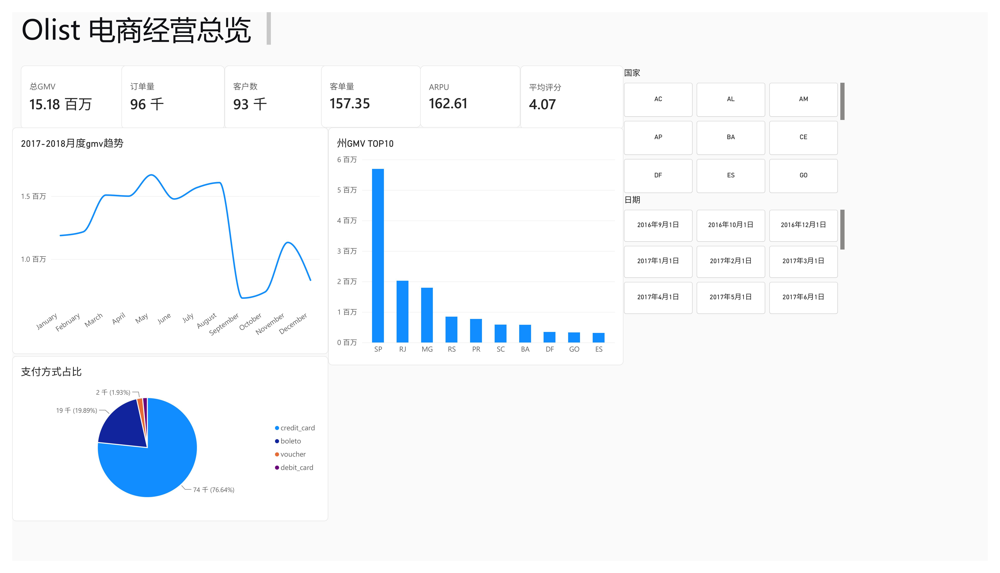
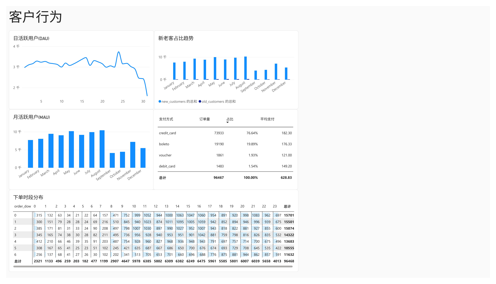
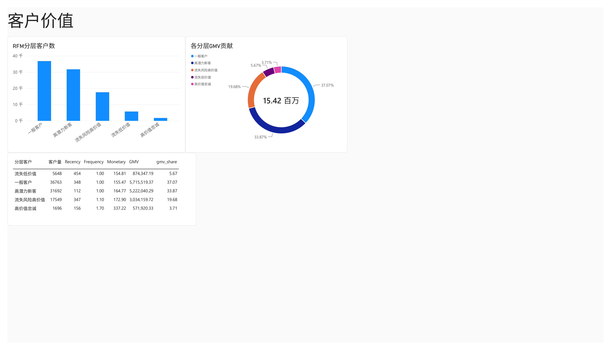
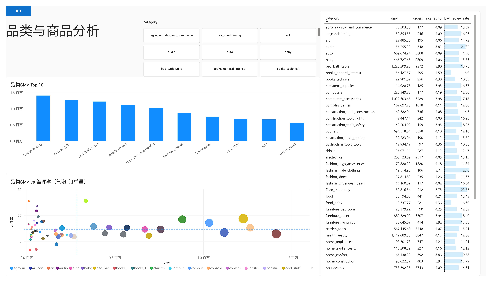
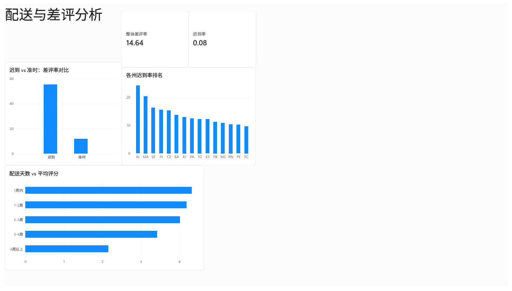
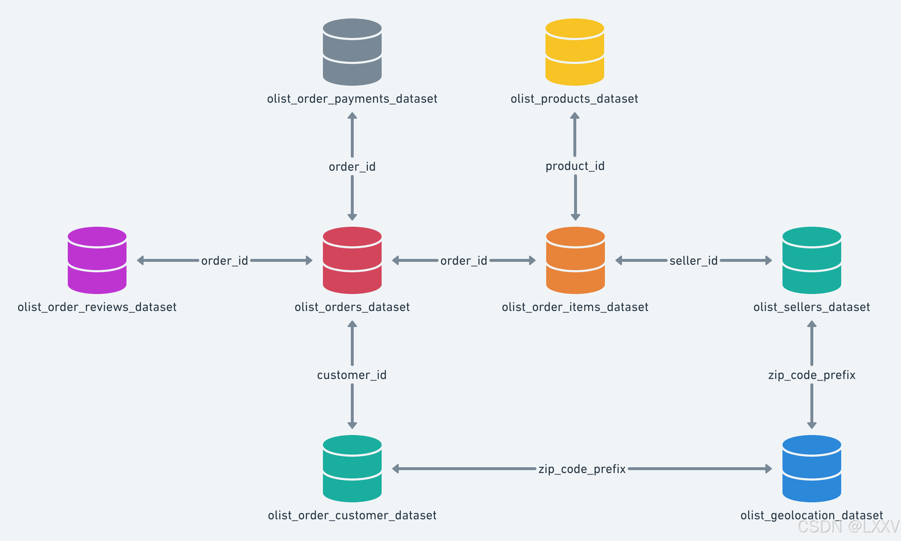
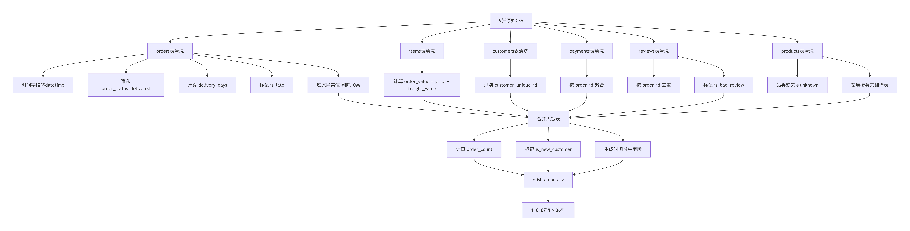

# Olist 电商经营分析与客户价值诊断

基于巴西电商平台 Olist 2016-2018 年约 10 万订单数据，从运营、客户、商品、配送四个维度分析经营状况，定位差评原因并提出策略建议。

## 技术栈

- Python (Pandas, Scikit-learn)
- MySQL
- Power BI

## 数据源

[Brazilian E-Commerce Public Dataset by Olist](https://www.kaggle.com/datasets/olistbr/brazilian-ecommerce)

## 分析框架

1. 基础数据探索与清洗（9 张表合并为 110,187 行大宽表）
2. 运营指标分析（GMV、AOV、ARPU、月度趋势）
3. 客户行为分析（DAU/MAU、复购率、新老客、RFM 分层）
4. 商品指标分析（品类 GMV、差评率）
5. 配送-差评-复购归因分析（核心亮点）

## 核心发现

- 订单级 GMV **1,517 万**，AOV **157.35**，ARPU **162.61**
- 复购率仅 **3.00%**，新客占比持续高于 **97%**，平台严重依赖拉新
- 迟到订单差评率 **55.23%**，是准时订单（11.73%）的 **4.7 倍**
- 配送 4 周以上订单差评率 **65.83%**，是 1 周内订单（9.88%）的 **6.7 倍**
- 高 GMV 高差评品类：**bed_bath_table、furniture_decor**
- 高迟到地区：**AL、MA、SE**
- RFM 分层：高价值忠诚客户仅 1,696 人（1.8%），客单价 337.22 元

## 策略建议

1. 物流优化：优先改善 AL、MA、SE 三州配送
2. 品类优化：对 bed_bath_table、furniture_decor 做品控与尺码优化
3. 客户召回：对 17,549 名流失风险高价值客户做定向召回
4. 会员体系：重设会员权益，提升复购
5. 支付体验：保持信用卡通道稳定，优化 boleto 流程

## 看板截图

### 经营总览


### 客户行为


### 客户价值


### 品类与商品


### 配送与差评


## 数据模型



## 数据清洗流程


## 项目结构

```
olist-ecommerce-analysis/
├── data/
│   ├── clean/
│   │   └── exported/
│   │       ├── monthly_gmv.csv
│   │       ├── dau.csv
│   │       ├── mau.csv
│   │       ├── new_old_customers.csv
│   │       ├── payment_type.csv
│   │       ├── category_gmv.csv
│   │       ├── category_bad_review.csv
│   │       ├── state_late_rate.csv
│   │       ├── delivery_bucket.csv
│   │       ├── late_vs_ontime.csv
│   │       ├── rfm_segment.csv
│   │       └── rfm_segment_summary.csv
│   └── raw/                             # 原始数据（不上传）
├── notebooks/
│   ├── 01_clean.ipynb
│   ├── 02_merge.ipynb
│   └── 03_export.ipynb
├── sql/
│   ├── 01_operations.sql
│   ├── 02_customer.sql
│   ├── 03_product.sql
│   └── 04_delivery_impact.sql
├── powerbi/
│   └── Olist.pbix
├── reports/
│   └── Olist分析报告.pdf
├── images/
│   ├── 1-经营总览.jpg
│   ├── 2-客户行为.jpg
│   ├── 3-客户价值.jpg
│   ├── 4-品类与商品.jpg
│   ├── 5-配送与差评.jpg
│   ├── er_diagram.png
│   └── data_cleaning_flow.png
├── .gitignore
└── README.md
```


> 注：原始数据（`data/raw/`）和清洗后的大宽表（`olist_clean.csv`）体积较大，未上传至仓库，运行项目前请先按“如何运行”章节下载并生成。
>
> ## 作者

- 姓名：顾佳琳
- 学校：盐城工学院 计算机科学与技术
- 邮箱：1525678830@qq.com
